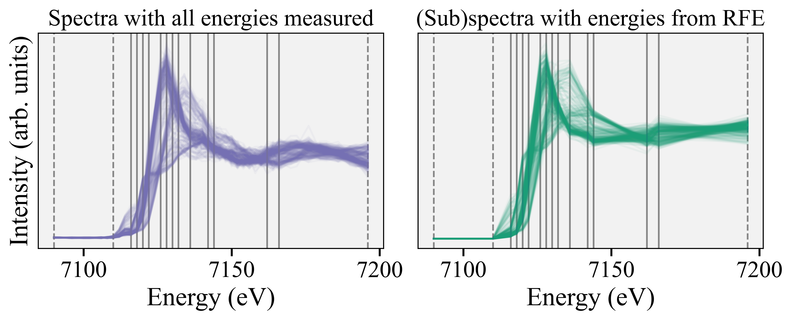

# nano-XANES-microscopy-of-Fe
Analysis of nanoscale XANES (nano-XANES) microscopy images of Fe K-edge. Data taken at the 3-ID Hard X-ray Nanoprobe (HXN) beamline at Brookhaven National Laboratory. Data courtesy of Ajith Pattamattel and Yong Chu.

Supplementary Fe 2p STXM data taken at the Advanced Light Source, beamline 11.0.2.2. Data courtesy of Brandy Toner and Matthew Marcus.

## The dataset

Every pixel (150 nm) in this image is an Fe K-edge XANES spectrum. There are about 25,000 spectra in this image.

## Manifold Projection Image Segmentation (MPIS)

We introduce an analysis pipeline for nano-XANES imaging that first performs image segmentation (identifyging domains in the image that are similar) before identifying the identity of those domains via the standard linear combination fitting procedure (LCF) onto a reference library. We call this pipeline Manifold Projection Image Segmentation (MPIS). MPIS has three main benefits:

1. MPIS decouples the idenitification of domains from linear combination fitting analysis, which removes dependence on an appropriate reference library and does not propogate errors from the linear combination fitting algorithm.
2. MPIS can encode auxiliary information (such as spatial location of each pixel and mulitmodal spectroscopies like X-ray fluorescence to identify elemental composition) into the image segmentation pipeline.
3. MPIS is more robust to noise in the spectra; it intelligentally averages spectra together rather than losing spatial resolution when Gaussian blurring the image.

DOI: TBD

## Feature selection to speed up imaging

Spectroscopic imaging experiments take a long time because every pixel is comprised of a spectrum, which can contain 50 to 100 energy points. Instead of identifying spatial regions of interest and sacrificing global images, we utilized feature selection to determine fewer energies to measure in each spectrum. Specifically, we used Recursive Feature Elimination to determine the best 13 energies in XANES in the context of linear combination fitting to a reference library. We then added 3 energies to esnure normalization for a total of 16 energy points in our subspectra (compared to the original 75 points).  

We found robust results using the subpectra compared the the full energy point spectra, both with MPIS and the standard pixel-by-pixel analysis.

DOI: TBD
